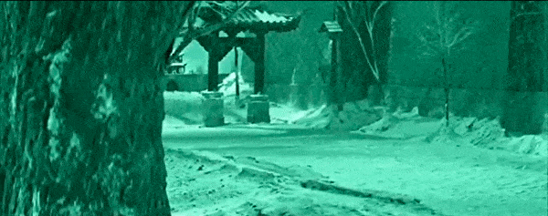
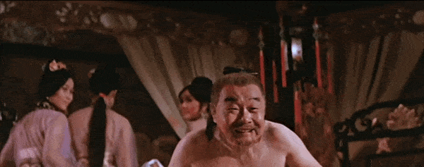
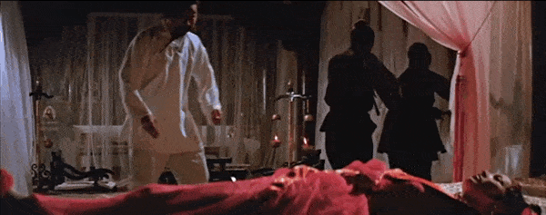
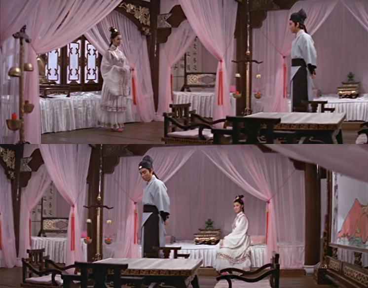
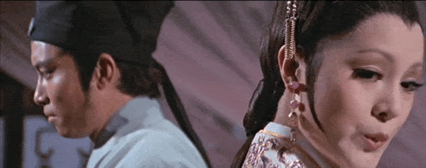
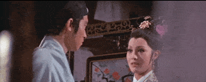

《爱奴》是楚原导演拍摄于1972年的电影，这部电影往往被人提起都是因为它是「中国电影史上第一部女同性恋电影」。现在看来这部电影在叙述上无甚特别，但在当年可谓是「风格诡异、构思奇特」，所以多年来很多影评也用「奇诡」来形容本片。

影片一开场是黑白画面（我的片源是绿色的）的户外冰冷雪景，镜头通过从屋顶透过的光束和飘雪一路下移、推进，停留在一具覆盖着积雪的尸体上，接着由其他角色说出死者生前最后见的人是爱奴，于是电影正式出片名字幕开始倒叙。这样的开场既从情节上增加了悬念，又从氛围增加了凄迷冷峻的悬疑感，钩子下的很有吸引力。

《爱奴》开场画面

故事正式从爱奴被拐卖到妓院四季春开始，因为她性格刚烈不肯屈从就范，所以吃了很多的苦头，直到燕顺子因为看不过眼打算救她却被四季春老板春姨和她的手下杀死，爱奴终于决定顺从了。而春姨非常迷恋爱奴，不止把自己的全部武功都教授给她，而且又对她十分信任。爱奴在与春姨卿卿我我的表面顺从之外，却谋划着复仇。她逐次杀掉了多年来消费她的人。剧情发展到她杀死了第一个员外时，承接到影片开始的部分，官府于是介入调查。而除了负责调查的捕头，其他无论是嫖客还是春姨都不曾怀疑爱奴。以致最终这些嫖客和春姨都死在了爱奴的手上。这也是影片想要表达的一个主题：「用爱来报仇比用恨更狠毒」。

整个电影第二幕有趣的地方包括爱奴杀死那几位主要嫖客的方式，和当初她被这些人凌辱的方式是对照的。当年对她捆绑侮辱的人，就被爱奴捆绑着烧死；喂她吃春药侮辱她的人，就被爱奴用计让其服食过量春药而死；对她SM的人，也被爱奴活活地鞭笞致死。看着真是过瘾啊！关于这组对照的前半段，就是嫖客凌辱的场面，导演用了一种「适可而止」的方式，他们一个个急色鬼样地扑向爱奴时，画面戛然而止，定格在他们的丑态上。从观感上来看，一方面省略掉了接下来更加不堪的画面，另一方面在如此令人难受的剧情中增加了一点喜剧感，毕竟这不是一个暗黑系情色片。

丑陋的嫖客1

丑陋的嫖客2

关于拍摄，中间有一场捕头来到四季春向爱奴问话的剧情，2分半的时间里几乎没有一个重复的镜头方式。导演通过演员的走位，不断变换和为画面找到新的平衡；摆脱普通的正反打，让演员都以侧脸对着镜头，通过焦点在他们脸上的移动来切换说话主体；还有景别随着对话的句句逼近而发生由大到小的变换，从画面上产生压迫感，而又在僵持之后拉大景别应和了人物将话题转移的情节。楚原先生在这部电影的拍摄上，表现出了一种强迫症般的讲究。

通过走位实现新的画面平衡

变焦切换说话主体

通过景别变换来渲染对话气氛

另外在立意上，除了「女同性恋」之外，更多表现的是一种女性的自救，可以说是优秀的女性主义电影。我还很喜欢影片中春姨这一角色，她是一个纯粹的女同性恋，面对男人对她十年的付出，她的态度一直是「我就是不喜欢男人」，我觉得这种坚定的陈述比起片中两个女人之间的吻戏更加显得「大胆」——因为「就是不喜欢」，所以男人可以不再重要了。当年只有19岁且初次演戏的贝蒂小姐把这个冷艳、狠毒的春姨演得如此鲜活甚至迷人，真是了不起。

看完这部电影，让我对饰演了《壹号皇庭》里程大法官和TVB版《西游记》里的如来佛祖的楚原老先生产生了极大的兴趣。
