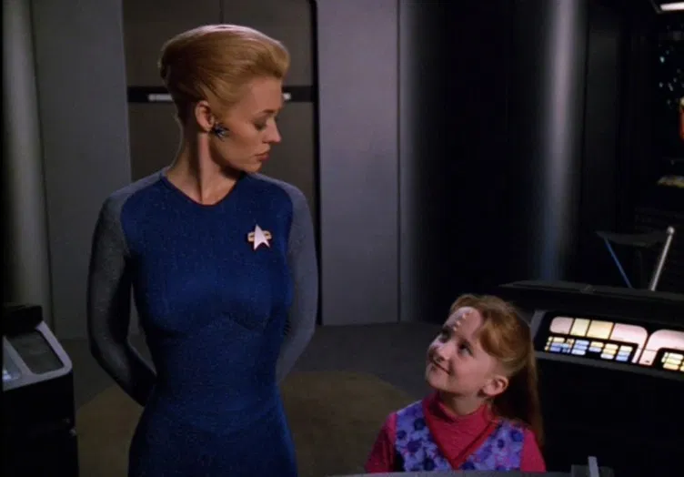
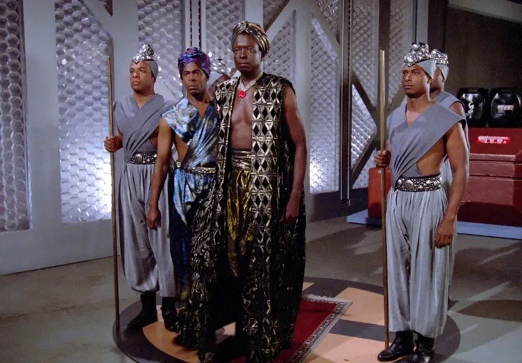

  <small>本文的作者是 Jarrah Hodge ，载于「<a href="https://www.womenatwarp.com/how-to-do-feminist-media-analysis-star-trek-edition/">曲速女性</a>」网站，由本人自译。</small> 
  <small>I translated this article from 'Women At Warp' to Chinese. <a href="https://www.womenatwarp.com/how-to-do-feminist-media-analysis-star-trek-edition/">Here</a> is the original article.</small>

信不信由你，以女权主义视角来看电视可以很有趣，而且也不难。归根结底，这只是批判性思考——对你正在看的媒体提出问题。

如果我们不批判性地看待媒体，那么它会对我们如何看待来自不同背景的人产生不当的影响。这种不当的影响还包括我们购买什么产品，我们判断什么样的行为得体或不得体。

例如媒体会助长我们对自己外表的不自信，只因为我们达不到广告里的要求。或者向我们提供关于未来的新的可能性，就像「星际迷航」一直以来的影响。

当有人批评媒体中对各种事情的呈现时，不代表是讨厌你喜欢的节目。就像我和与我一起主持「曲速女性」的各位一直对《星际迷航》的评论一样，你真的得非常喜欢这个IP，对它有足够的关心，才能去思考它是否值得你花时间在上面，并且让它变得更好。

那么我这里提到的「女性主义」是什么意思呢？我引用[贝尔·胡克斯对女性主义的定义](https://www.goodreads.com/quotes/679711-simply-put-feminism-is-a-movement-to-end-sexism-sexist)：「一个结束性别歧视、性别剥削和压迫的运动。」而且我相信，如果我们不解决同时存在着的那些不平等和压迫，例如种族主义、恐同、恐惧症、能力主义和阶级主义，我们就无法实现所有女性的平等。这影响了我在看电视时会提出什么样的问题和如何理解我看到的信息，特别是对《星际迷航》。

以下就是当我对媒体进行女性主义分析时我会提出的问题：

## 一般性问题：

- 谁是主要角色？他们从人口统计学上看是怎样的（包括性别、种族、年龄、性取向）？
- 他们当中有人有独特的能力或残障吗（如Troi的心灵感应和Geordi的失明）？
- 主要角色的特征是什么？兴趣、爱好是什么？这些是强化还是挑战了关于性别、种族等的刻板印象？
- 他们作为独立个体和他们在亲密关系中、社会群体中、在工作中、组织中拥有多少权力？
- 他们的穿着是如何定义他们的？
- 在这个剧集中，一个角色是如何改变和发展的？
- 观察一场戏中的背景处，看看群演的多样性如何？
- 有哪些角色或情节是套路化的，或者有没有重复出现某些套路？
  <small>根据[TVTropes.org](http://tvtropes.org/pmwiki/pmwiki.php/Main/HomePage)的介绍：「套路就是作者们可以合理依靠的，可以在观众的思想和期待中呈现出来的工具或约定。」套路并不一定是不好的，但有些是存在问题的（例如「落难少女」），特别是被重复使用时。</small>
- 谁是目标受众？他们感兴趣的内容是如何被假设的？
- 谁创作的这部剧以及为什么？谁为它买单以及谁又从中受益？
- 这部剧或其中的某些场戏让你感受如何？和你来自不同背景的人看这部剧可能会有什么感受？例如，经历过性侵的人在看《法律与秩序：特殊受害者》时的感受和没经历过的人会有哪些不同？

## 针对《星际迷航》的问题：

- 有没有一些文化是代表或借鉴了现实地球文化中的刻板印象（例如《星际迷航：下一代》第一季第四集「荣誉守则」就是来自对黑人或非洲文化的刻板印象）？
- 这部剧告诉了我们人性可以成就什么？未来对人物的限制更多吗？
- 当角色们时间旅行回到地球的过去时，有哪些文化是被呈现出来的，哪些没有？
- 本剧的主创们希望现今社会的哪些方面会持续出现在23世纪和24世纪？
- 《星际迷航》的[周边产品](https://trekkiefeminist.tumblr.com/post/53306329826/a-janeway-apron-seriously)是如何迎合特定人群的？它们是如何呈现女性角色和有色人物等的？

## 贝克德尔-华莱士测试

[贝克德尔-华莱士测试](https://zh.wikipedia.org/wiki/%E8%B4%9D%E5%85%8B%E5%BE%B7%E5%B0%94%E6%B5%8B%E9%AA%8C)是一个简单的衡量方法，由莉兹·华莱士发明，并由她的朋友艾莉森·贝克德尔写进她的漫画《姬佬提防着》（*Dykes to Watch Out For*）而流传开来。能够通过测试的电影必须具有：1）至少有两个女性角色；2）她们之间要有对话；3）谈话内容与男性无关。这不是一个关于女性主义是否被呈现的测试，但是如果哪个媒体连这么基本的测试都不能通过的话，这就标志着女性角色被塑造的方式被限制住了。你可以阅读更多的关于贝克德尔-华莱士测试的文章，和这篇我发表在「玛丽苏」网站上的[关于《星际迷航》的文章](http://www.themarysue.com/star-trek-bechdel-test/)。

这可以让你对于我在观看《星际迷航》和评论它时在留意什么有个清晰的概念。我很乐于听到各位对这个主题有哪些问题要问，可以把它们加到上面的列表里。